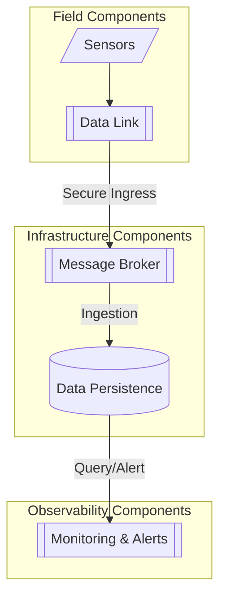

# Metric Link

Field-to-cloud environmental data foundations using Zephyr RTOS. Secure data logistics from microcontrollers to cloud infrastructure, providing a clean baseline for machine learning workflows.

For an architectural overview and discussion on decoupling edge infrastructure, refer to the [Metric Link Architecture Post](https://advt3.com/posts/mlink-data-foundations/).

For a comprehensive guide on setting up Zephyr with C++ on the Raspberry Pi Pico, refer to the [starting point guide](https://advt3.com/posts/zephyr-freestanding-cpp-rpi-pico-v4/).

## Architecture Overview

Metric Link is designed as a modular field-to-cloud pipeline. It bridges physical sensors with modern observability tools via a secure message broker, enforcing a strict separation of concerns.

- **Field**: Firmware built on Zephyr RTOS for Raspberry Pi Pico W and ESP32. It handles hardware abstraction and secure data delivery.
- **Transport**: Standard MQTT with TLS encryption for secure data movement over public networks.
- **Infrastructure**: A containerized stack on Google Cloud Platform, provisioned via Terraform, featuring high-performance storage and alerting.

## Documentation

- [00. Technical Overview](./docs/00-technical-overview.md): Architectural details, scaling paths, and library selection.
- [01. Hardware Setup](./docs/01-hardware-setup.md): Wiring guides and debug probe configuration.
- [02. Firmware Development](./docs/02-firmware.md): Building, flashing, and testing the device firmware.
- [03. Infrastructure & Operations](./docs/03-infrastructure.md): Cloud provisioning, secret management, and monitoring.

## Contributing

Refer to [CONTRIBUTE.md](./CONTRIBUTE.md) for naming standards, file structures, and guidelines on how to contribute to this project.

## Legal & Support

Licensed under [Apache 2.0](./LICENSE). 

This project is shared as-is as an architectural reference. For questions regarding the architecture or its application in field environments, feel free to reach out at [info@advt3.com](mailto:info@advt3.com).

